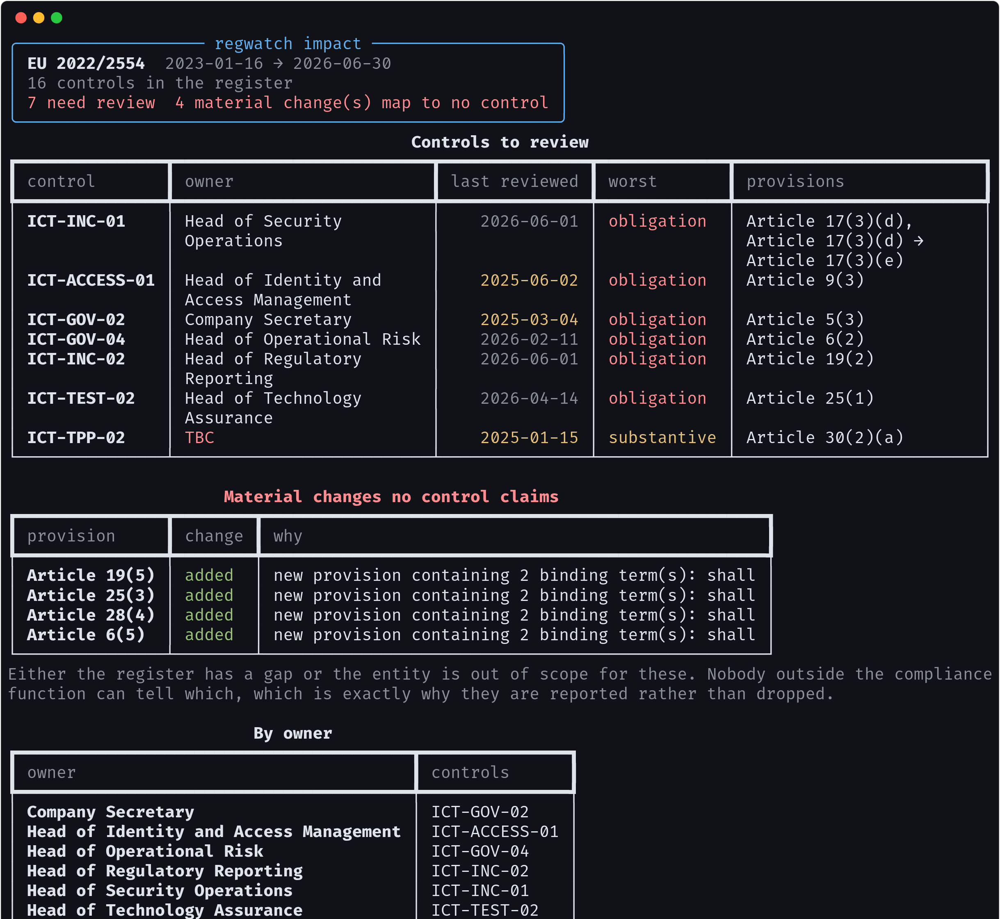
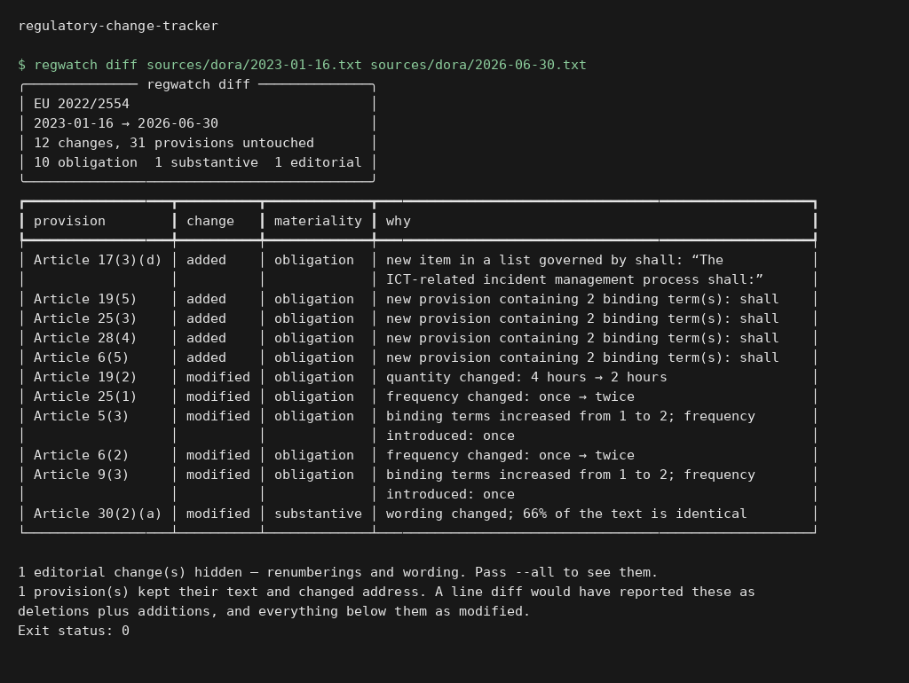
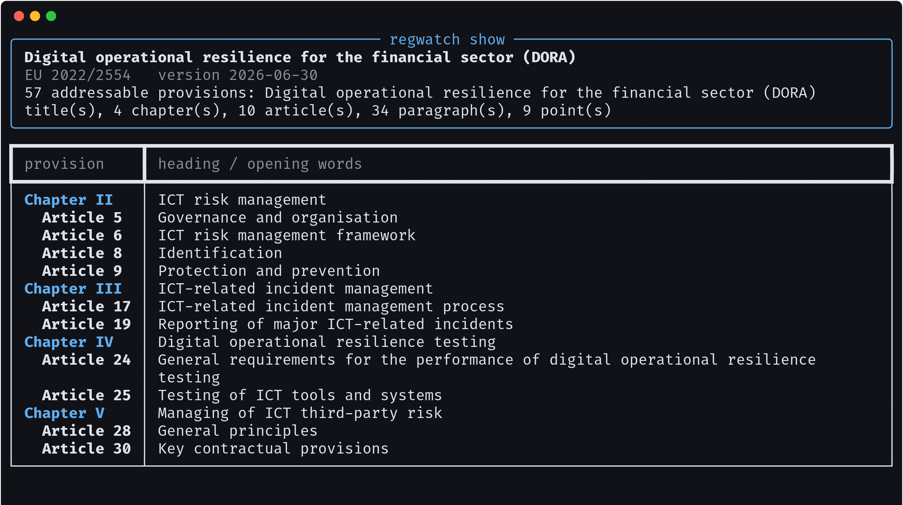
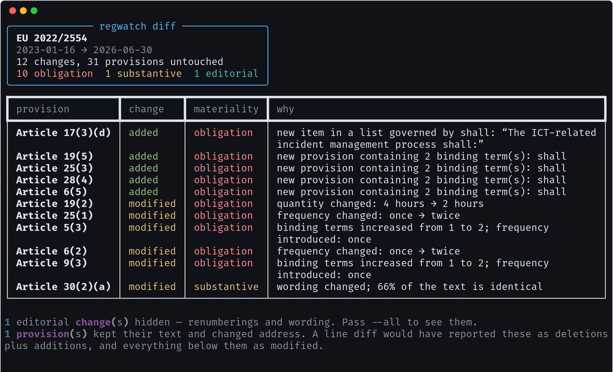
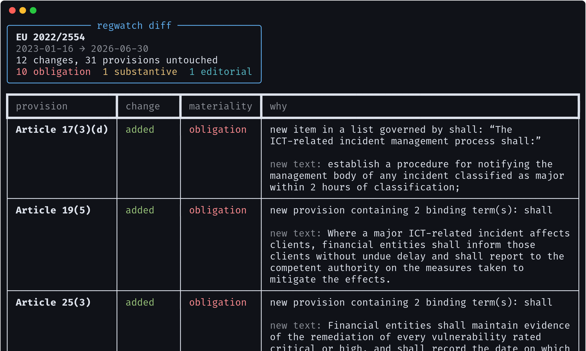
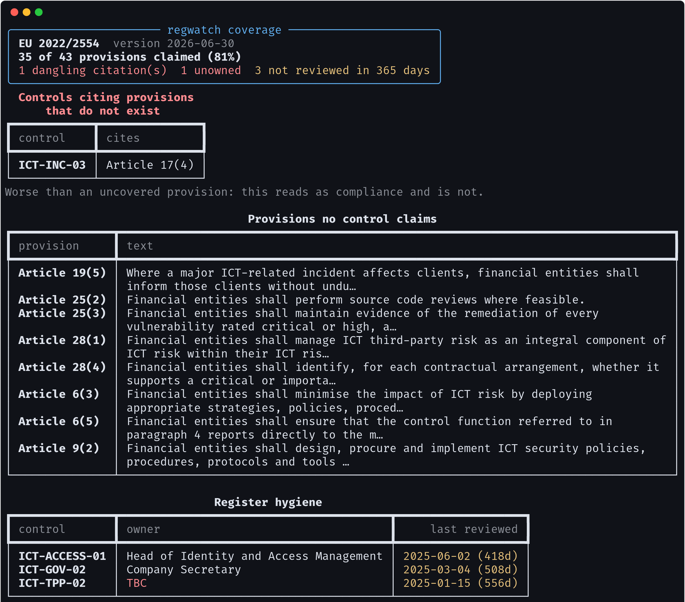
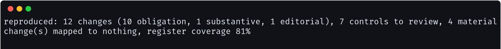

# regulatory-change-tracker

**Diff a regulation structurally, grade what changed, and land it on the people
who have to act.** Not a line diff of a PDF: a tree of numbered provisions, so
the output is `Article 19(2): 4 hours → 2 hours` rather than four hundred
shifted lines.

On a DORA amendment touching 12 provisions, it reports **10 obligation-level
changes, 7 controls to review, and 4 material changes that no control in the
register claims**. That last number is the one worth having the tool for.



```bash
pip install -e .
regwatch diff  sources/dora/2023-01-16.txt sources/dora/2026-06-30.txt
regwatch impact sources/dora/2023-01-16.txt sources/dora/2026-06-30.txt \
    --register register/controls.yaml
```

---

## Execution preview



Local execution of `regwatch diff sources/dora/2023-01-16.txt sources/dora/2026-06-30.txt`. The input and output shown come from the repository example or test fixtures. [Verification](docs/verification.md).

## Why a line diff is useless here

A regulation is a numbered hierarchy, and every reference anyone will ever make
to it — in a policy, a control description, a regulator's finding — is a path
through that hierarchy. `Article 11(4)(c)` is an address, not a line number.



Insert one paragraph into Article 11 and everything below it shifts. A line
diff reports Article 11 as changed, then 12, then 13, to the end of the
instrument. The reviewer reads fifteen "changes", finds fourteen identical to
what they already knew, and stops before the one that was real.

So `diff` matches structurally — and **the order of the passes is the whole
design**:

1. **Text first.** Identical content is paired wherever it now sits. A
   provision that only moved is reported as a *renumbering*.
2. **Address second.** What is left at the same path with different text is a
   genuine edit.
3. **Whatever survives** is genuinely added or genuinely removed.

Doing (1) and (2) the other way round — the obvious way, matching paths first —
defeats the exercise entirely. This is not hypothetical; it is what the first
version of this repository did, and the bundled amendment caught it:

> DORA's Article 17(3) gains a new point (d) requiring the management body to
> be notified within 2 hours. The old (d), the communications plan, becomes
> (e). Matching paths first paired the **new** (d) against the **old** (d) and
> called it an edit — "quantity introduced: 2 hours" — then found the
> communications plan at (e) and called it a new provision. Both statements
> were false. The one real finding, a new obligation, was buried under them.

Matching text first gives the right answer: one addition, one renumbering.

```
Article 17(3)(d)                     added        obligation
Article 17(3)(d) → Article 17(3)(e)  renumbered   editorial
```

---

## Grading what changed

Not every amendment matters, and a tool that says they all do is a tool nobody
runs twice. Materiality is graded from the text itself, and every grade comes
with the sentence that justifies it.



| grade | means |
|---|---|
| `obligation` | a duty created, withdrawn, or its deadline / frequency / scope altered |
| `substantive` | the requirement changed in a way that alters conduct |
| `editorial` | wording, cross-references, renumbering |

Three signals decide it, and each was added because the version without it got
a real change wrong:

**Deontic verbs.** In EU drafting `shall` is not a stylistic choice — it
creates a duty, where `may` creates a discretion and `should` creates neither.
Counting them before and after is how a new obligation is told from a
clarification.

**Deadlines and frequencies, including the ones written in words.** The first
version matched digits only, so `Article 25(1)` — *"vulnerability assessments
at least **once** a year"* becoming *"at least **twice** a year"* — came out
**editorial**, on a 98% text similarity. That single amendment doubles an
institution's scanning obligation. A false negative there is the most expensive
output this tool can produce, so `FREQUENCY` now matches the words as well as
the numbers.

**The chapeau a list hangs from.** EU drafting puts the binding verb in the
introduction and not in the points:

```
3. The ICT-related incident management process shall:
   (a) put in place early warning indicators;
   (b) establish procedures to identify, track, log ...
```

Read alone, point (b) contains no binding term and grades as a clarification.
Read with its chapeau it is a duty. Since lists are where an instrument's
operational detail lives, a classifier that ignores the chapeau systematically
under-grades exactly the provisions a compliance function most needs to see —
which is what happened to the new Article 17(3)(d) until `classify()` learned
to look up.

Pass `--text` to see the before and after behind each grade:



---

## From "the text changed" to "these people have work to do"

A diff is a fact about a document. `impact` produces the next sentence: which
controls relied on the amended provisions, who owns them, when they were last
reviewed.

The mapping is **explicit** — each control names the provisions it implements —
and that is a deliberate refusal of the obvious alternative. Keyword matching
between regulatory text and control descriptions demos beautifully and fails in
the direction that costs most: it silently misses the control nobody happened
to write in the regulator's vocabulary. An unmapped provision is visible in
`regwatch coverage`; a control a fuzzy matcher failed to surface is invisible
until an examination.

```yaml
- id: ICT-INC-02
  title: Regulatory incident reporting within the deadlines
  owner: Head of Regulatory Reporting
  instrument: EU 2022/2554
  provisions: ["Article 19(1)", "Article 19(2)", "Article 19(3)", "Article 19(4)"]
  last_reviewed: 2026-06-01
```

Containment runs downward only. A control mapped to `Article 17` is implicated
by a change to `Article 17(3)(a)`. A control mapped to `Article 17(3)(a)` is
**not** implicated by a change to `17(3)(b)` — widening that turns a change
report into a list of everything, which is the same as no report at all.

**Four of the material changes map to nothing.** Every one is a brand-new
paragraph, so a register could not have covered it. Either it is a genuine gap
or the entity is out of scope, and nobody outside the compliance function can
tell which — which is exactly why they are reported rather than dropped.

The tool says **which controls need review**, never which controls are
non-compliant. Whether an amended provision breaks a control is a judgement
about that control's design, and no diff can make it.

---

## Before anything changes at all

`coverage` asks the question worth asking on its own schedule.



The register claims 35 of 43 provisions. It also contains one control citing
**`Article 17(4)`, which does not exist** — the incident communications
requirement is a *point* under 17(3). A mis-citation like that survives for
years because nothing reads it, and it is worse than an uncovered provision:
it reads as compliance and is not.

Alongside it: one control with no owner (`TBC`), and three not reviewed in over
a year. None of that is a diff finding. All of it would otherwise surface
mid-change-round, as a surprise rather than a task.

---

## The digest

`regwatch digest` writes the markdown that actually gets sent — unclaimed
changes first, then work grouped by owner, then the full table.

```bash
regwatch digest sources/dora/2023-01-16.txt sources/dora/2026-06-30.txt \
    --register register/controls.yaml --out docs/digest-2026-06-30.md
```

[docs/digest-2026-06-30.md](docs/digest-2026-06-30.md) is the committed output.

---

## Reproducing the figures



```bash
python3 scripts/reproduce.py          # fails if any published figure moved
python3 scripts/reproduce.py --write  # accept new figures
```

`results/expected.json` holds every number in this README. Change the
materiality rules and the check fails until the README is true again. The
staleness figures are measured against a fixed date rather than `today()`, so
they do not drift.


```bash
python3 -m pytest -q     # 72 tests
ruff check .
```

The tests worth reading are the first section of `tests/test_diff.py`, which
pins the ordering of the matching passes. If someone "simplifies" the diff to
match paths first, those fail.

---

## Commands

```
regwatch show DOC [--article N]              the structure a document parsed into
regwatch diff BEFORE AFTER                   what changed
       [--all] [--text] [--json OUT] [--fail]
regwatch impact BEFORE AFTER --register R    which controls it lands on
regwatch coverage DOC --register R           what the register does not claim
       [--stale-after DAYS] [--quiet]
regwatch digest BEFORE AFTER --register R --out FILE
```

`--fail` exits non-zero, for a scheduled job that should open a ticket.
`--today YYYY-MM-DD` fixes the clock so output is reproducible.

---

## About the bundled sources

`sources/dora/` holds two versions of an instrument identified as
EU 2022/2554 (DORA). They are an **illustrative reconstruction**: a subset of
articles, restructured for length, with the 2026 amendment invented for this
repository. They are shaped like the real thing — the drafting conventions,
the numbering, the chapeau-and-points pattern — because those conventions are
what the parser and classifier are built around. They are not the authoritative
text and must not be used as a source of law. The Official Journal is.

The control register is likewise fictional, including its defects: the
mis-citation, the unowned control and the stale review dates are there because
a register with none of those is not a register anyone has ever seen.

---

## What this does not do

It does not fetch anything. Watching the OJ, the EBA and ESMA feeds is a source
adapter and a scheduler, and both are the easy part; what this repository
provides is the bit downstream of the fetch, which is where regulatory-change
tooling usually stops at "here is a PDF, and it is different".

It does not read PDFs. Text extraction from a formatted instrument is its own
problem with its own failure modes, and hiding it inside this one would make
both harder to trust.

It does not decide compliance. It grades how a provision changed, not how risky
that change is for a given institution. That judgement needs to know what the
institution does, which a diff cannot.

---

## Licence

MIT
